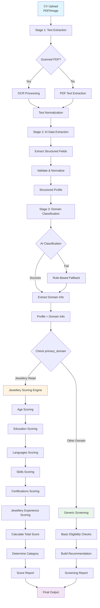
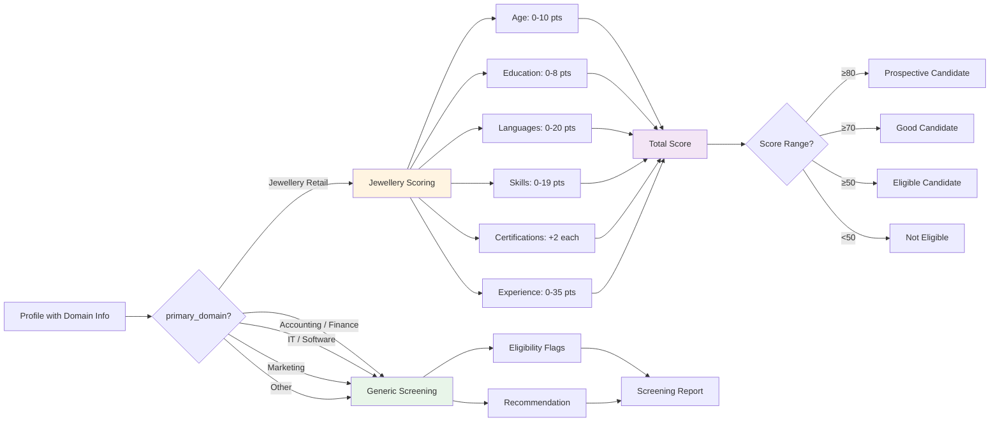

# CV Shortlisting System - Architecture Flowchart

## Multi-Stage Funnel Architecture

This document explains the logic flow of the AI-based CV shortlisting system using a multi-stage funnel approach.

---

## Visual Flowchart (Mermaid)



---

## Decision Router Flow (Detailed)



---

## High-Level Flow

```
┌─────────────────────────────────────────────────────────────────┐
│                    CV UPLOAD (Any Profession)                    │
│                    PDF / Image Files                             │
└────────────────────────────┬────────────────────────────────────┘
                              │
                              ▼
┌─────────────────────────────────────────────────────────────────┐
│                    STAGE 1: TEXT EXTRACTION                      │
│  • PDF Text Extraction (pdfplumber, pdfminer, pypdfium2)       │
│  • OCR Fallback (if scanned PDF detected)                       │
│  • Text Normalization                                           │
└────────────────────────────┬────────────────────────────────────┘
                              │
                              ▼
┌─────────────────────────────────────────────────────────────────┐
│              STAGE 2: AI DATA EXTRACTION                         │
│  • Extract structured data (name, age, experience, etc.)        │
│  • Parse education, skills, certifications                      │
│  • Extract visa information                                    │
└────────────────────────────┬────────────────────────────────────┘
                              │
                              ▼
┌─────────────────────────────────────────────────────────────────┐
│          STAGE 3: DOMAIN CLASSIFICATION (Stage 1 & 2)            │
│                                                                   │
│  ┌─────────────────────────────────────────────────────────┐   │
│  │  AI Classification:                                     │   │
│  │  • Analyze job titles, keywords, employers              │   │
│  │  • Determine primary_domain                              │   │
│  │  • Identify sub_domain (role within domain)             │   │
│  │  • Calculate confidence score                            │   │
│  └─────────────────────────────────────────────────────────┘   │
│                                                                   │
│  Available Sectors (primary_domain):                             │
│  • Jewellery Retail (jewellery companies, showrooms)            │
│  • General Retail (non-jewellery retail)                        │
│  • Hospitality (hotels, restaurants)                            │
│  • Healthcare (hospitals, clinics)                              │
│  • Education (schools, colleges)                                │
│  • IT Services (software companies)                             │
│  • Financial Services (banks, finance companies)                │
│  • Manufacturing (manufacturing companies)                     │
│  • Construction (construction companies)                        │
│  • Other / Mixed (other or unclear sectors)                     │
│                                                                   │
│  Professions (sub_domain):                                       │
│  • Sales Executive, Accountant, Software Developer, etc.        │
└────────────────────────────┬────────────────────────────────────┘
                              │
                              ▼
┌─────────────────────────────────────────────────────────────────┐
│              STAGE 4: DECISION ROUTER                           │
│                                                                   │
│  ┌───────────────────────────────────────────────────────┐   │
│  │  IF primary_domain == "Jewellery Retail":              │   │
│  │     └─► Route to Jewellery Scoring Engine (v3)        │   │
│  │                                                          │   │
│  │  ELSE:                                                   │   │
│  │     └─► Route to Generic Screening                      │   │
│  └───────────────────────────────────────────────────────┘   │
└────────────────────────────┬────────────────────────────────────┘
                              │
                    ┌─────────┴─────────┐
                    │                   │
                    ▼                   ▼
    ┌──────────────────────────┐  ┌──────────────────────────┐
    │  JEWELLERY SCORING        │  │  GENERIC SCREENING        │
    │  (v3 Engine)              │  │  (Basic Eligibility)      │
    └──────────────────────────┘  └──────────────────────────┘
```

---

## Detailed Flowchart

### Stage 1: Text Extraction

```
┌─────────────────┐
│   Upload CV     │
│  (PDF/Image)    │
└────────┬────────┘
         │
         ▼
┌─────────────────────────────────────┐
│  Extract Text                       │
│  • Try PDF extraction methods       │
│  • Check if scanned PDF             │
└────────┬────────────────────────────┘
         │
         ├─── Scanned PDF? ──YES──► OCR Processing
         │
         NO
         │
         ▼
┌─────────────────────────────────────┐
│  Normalize Text                     │
│  • Clean and format                 │
└────────┬────────────────────────────┘
         │
         ▼
    [Text Ready]
```

### Stage 2: AI Data Extraction

```
┌─────────────────┐
│  Normalized Text │
└────────┬────────┘
         │
         ▼
┌─────────────────────────────────────┐
│  AI Extraction (LLM)                │
│  • Extract structured fields:       │
│    - Personal info (name, age)      │
│    - Experience (years, countries)  │
│    - Education (degree, qualifications)│
│    - Skills (IT, marketing, etc.)   │
│    - Certifications                 │
│    - Visa information               │
└────────┬────────────────────────────┘
         │
         ▼
┌─────────────────────────────────────┐
│  Validate & Normalize               │
│  • Pydantic validation              │
│  • Country mapping                   │
└────────┬────────────────────────────┘
         │
         ▼
    [Structured Profile]
```

### Stage 3: Domain Classification

```
┌──────────────────────┐
│  Structured Profile  │
│  + CV Text           │
└──────────┬───────────┘
           │
           ▼
┌─────────────────────────────────────┐
│  Domain Classifier (AI)             │
│  • Analyze:                         │
│    - Job titles                     │
│    - Keywords                       │
│    - Employer industries            │
│    - Tools/skills mentioned         │
│    - Certifications                 │
└──────────┬──────────────────────────┘
           │
           ├─── AI Success? ──YES──► Extract domain
           │
           NO
           │
           ▼
┌─────────────────────────────────────┐
│  Rule-Based Fallback                │
│  • Keyword matching                 │
│  • Score domains                    │
│  • Select highest score             │
└──────────┬──────────────────────────┘
           │
           ▼
┌─────────────────────────────────────┐
│  Domain Classification Result       │
│  • primary_domain                   │
│  • sub_domain                       │
│  • domain_confidence                │
│  • secondary_domains                │
└──────────┬──────────────────────────┘
           │
           ▼
    [Profile + Domain Info]
```

### Stage 4: Decision Router

```
┌─────────────────────────────┐
│  Profile + Domain Info       │
└──────────┬──────────────────┘
           │
           ▼
┌─────────────────────────────────────┐
│  Check primary_domain               │
└──────────┬──────────────────────────┘
           │
           ├─── "Jewellery Retail"? ──YES──►
           │                                    │
           NO                                   │
           │                                    │
           ▼                                    ▼
┌──────────────────────────┐  ┌──────────────────────────────┐
│  Generic Screening       │  │  Jewellery Scoring Engine     │
│                          │  │  (v3)                        │
│  • Age check             │  │                              │
│  • Languages count       │  │  • Age scoring                │
│  • Education check       │  │  • Education scoring          │
│  • Visa status           │  │  • Languages scoring         │
│  • Basic eligibility     │  │  • Skills scoring            │
│                          │  │  • Certifications scoring    │
│  Returns:                │  │  • Jewellery experience      │
│  • Recommendation        │  │    scoring                    │
│  • Eligibility flags     │  │                              │
│  • Basic info summary    │  │  Returns:                    │
│                          │  │  • Total score               │
│                          │  │  • Category (Prospective/    │
│                          │  │    Good/Eligible)            │
│                          │  │  • Detailed breakdown        │
│                          │  │  • Segment details           │
│                          │  │  • Strengths                 │
└──────────┬───────────────┘  └──────────┬───────────────────┘
           │                             │
           └──────────┬──────────────────┘
                      │
                      ▼
┌─────────────────────────────────────┐
│  Final Report                       │
│  • Status: "scored" or "screened"   │
│  • Domain information               │
│  • Score/Recommendation             │
│  • Detailed breakdown               │
└─────────────────────────────────────┘
```

---

## Scoring Logic (Jewellery Retail Only)

### Jewellery Scoring Engine (v3)

```
┌─────────────────────────────────────┐
│  Jewellery Profile                  │
└──────────┬──────────────────────────┘
           │
           ▼
┌─────────────────────────────────────┐
│  Age Scoring                       │
│  • 18-25: 10 points                 │
│  • 26-30: 8 points                  │
│  • 31-35: 5 points                  │
│  • 36+: 0 points                    │
└──────────┬──────────────────────────┘
           │
           ▼
┌─────────────────────────────────────┐
│  Education Scoring                  │
│  • Highest qualification only:      │
│    - 10th: 2 points                  │
│    - 12th: 4 points                 │
│    - Degree: 7 points                │
│    - Postgraduate: 8 points         │
└──────────┬──────────────────────────┘
           │
           ▼
┌─────────────────────────────────────┐
│  Languages Scoring                   │
│  • +2 per language (cap at 20)      │
│  • Counted languages:                │
│    Hindi, Tamil, Telugu, Malayalam,  │
│    Kannada, Bengali, Urdu, Sinhala, │
│    English, Arabic                   │
└──────────┬──────────────────────────┘
           │
           ▼
┌─────────────────────────────────────┐
│  Skills Scoring                     │
│  • Tally/Accounting: +3             │
│  • AML/Compliance: +3                │
│  • Digital Marketing: +5            │
│  • Graphic Design: +3                │
│  • UAE Driving License: +5          │
└──────────┬──────────────────────────┘
           │
           ▼
┌─────────────────────────────────────┐
│  Certifications Scoring             │
│  • +2 per jewellery certification   │
│  • Keywords: jewellery, gem,        │
│    diamond, GIA, IGI, HRD, etc.    │
└──────────┬──────────────────────────┘
           │
           ▼
┌─────────────────────────────────────┐
│  Jewellery Experience Scoring       │
│  • UAE: up to 35 points              │
│  • India: up to 25 points            │
│  • Other: up to 20 points            │
│  • Marketing-facing bonus: +5        │
│  • Reputed jeweller bonus: +5 each  │
│    (max +10)                        │
└──────────┬──────────────────────────┘
           │
           ▼
┌─────────────────────────────────────┐
│  Calculate Total Score              │
│  • Sum all segment scores           │
└──────────┬──────────────────────────┘
           │
           ▼
┌─────────────────────────────────────┐
│  Determine Category                 │
│  • ≥80: Prospective Candidate       │
│  • ≥70: Good Candidate              │
│  • ≥50: Eligible Candidate          │
│  • <50: Not Eligible                │
└──────────┬──────────────────────────┘
           │
           ▼
┌─────────────────────────────────────┐
│  Build Report                       │
│  • Total score                      │
│  • Category                         │
│  • Breakdown by segment             │
│  • Detailed segment info            │
│  • Strengths                        │
│  • Visa info (not scored)           │
└─────────────────────────────────────┘
```

---

## Generic Screening Logic (Non-Jewellery)

```
┌─────────────────────────────────────┐
│  Non-Jewellery Profile              │
└──────────┬──────────────────────────┘
           │
           ▼
┌─────────────────────────────────────┐
│  Basic Eligibility Checks           │
│  • Age: 18-60 range?                │
│  • Languages: ≥2 languages?        │
│  • Education: Has degree/diploma?   │
└──────────┬──────────────────────────┘
           │
           ▼
┌─────────────────────────────────────┐
│  Build Recommendation               │
│  • Route to [Domain] Hiring Team   │
│  • Eligibility flags                │
│  • Basic info summary               │
└──────────┬──────────────────────────┘
           │
           ▼
┌─────────────────────────────────────┐
│  Generic Screening Report           │
│  • Status: "screened"                │
│  • Primary domain                   │
│  • Recommendation                   │
│  • Eligibility indicators          │
│  • Basic information                │
└─────────────────────────────────────┘
```

---

## Key Design Principles

### 1. **Funnel Architecture**
   - Each stage filters and processes data
   - No rejection until final scoring
   - All CVs go through classification

### 2. **Policy-Driven Routing**
   - Python logic decides routing (not AI)
   - Explicit rules: `IF domain == "Jewellery Retail" THEN score ELSE screen`
   - Easy to extend with new domains

### 3. **Separation of Concerns**
   - **AI**: Understanding, extraction, classification
   - **Python**: Business logic, scoring, routing
   - **Deterministic**: Scoring is always reproducible

### 4. **Future-Proof**
   - Add new domains without changing core logic
   - Add domain-specific scoring engines
   - Same CV ingestion, different scoring

---

## Data Flow

```
CV File
  │
  ├─► Extract Text ──► Normalized Text
  │
  ├─► AI Parse ──► Structured Profile
  │
  ├─► Domain Classify ──► Domain Info
  │
  ├─► Router Decision
  │     │
  │     ├─► Jewellery? ──► Jewellery Scoring ──► Score Report
  │     │
  │     └─► Other? ──► Generic Screening ──► Screening Report
  │
  └─► Final Output (JSON)
```

---

## API Endpoints Flow

```
POST /api/cv/extract
  │
  ├─► Upload files
  ├─► Extract text (PDF/OCR)
  └─► Return: { text, text_preview, meta }

POST /api/cv/parse
  │
  ├─► Receive: { text }
  ├─► AI extraction (structured data)
  ├─► Domain classification (Stage 1 & 2)
  └─► Return: { profile: CandidateProfile }

POST /api/cv/score
  │
  ├─► Receive: { profile: CandidateProfile }
  ├─► Check primary_domain
  │     │
  │     ├─► "Jewellery Retail"? ──► Jewellery Scoring
  │     │
  │     └─► Other? ──► Generic Screening
  │
  └─► Return: { status, score/recommendation, ... }
```

---

## Error Handling & Fallbacks

```
┌─────────────────────────────────────┐
│  Domain Classification               │
└──────────┬──────────────────────────┘
           │
           ├─► AI Success? ──YES──► Use AI result
           │
           NO
           │
           ▼
┌─────────────────────────────────────┐
│  Rule-Based Fallback                │
│  • Keyword matching                 │
│  • Score domains                    │
│  • Select highest                   │
└─────────────────────────────────────┘
```

---

## Example Scenarios

### Scenario 1: Jewellery Sales Executive
```
CV Upload
  └─► Extract: "Sales Executive at Damas Jewellery..."
      └─► Parse: { experience: { jewellery_years: 5 }, ... }
          └─► Classify: primary_domain = "Jewellery Retail"
              └─► Route: Jewellery Scoring Engine
                  └─► Score: 65 points → "Good Candidate"
```

### Scenario 2: Accountant
```
CV Upload
  └─► Extract: "Accountant, Tally, GST, Ledger..."
      └─► Parse: { skills: { it_skills: ["Tally"] }, ... }
          └─► Classify: primary_domain = "Accounting / Finance"
              └─► Route: Generic Screening
                  └─► Report: "Route to Accounting / Finance Hiring Team"
```

### Scenario 3: Software Developer
```
CV Upload
  └─► Extract: "Python Developer, React, API..."
      └─► Parse: { skills: { it_skills: ["Python", "React"] }, ... }
          └─► Classify: primary_domain = "IT / Software"
              └─► Route: Generic Screening
                  └─► Report: "Route to IT / Software Hiring Team"
```

---

## Benefits of This Architecture

1. **Scalable**: Easy to add new domains and scoring engines
2. **Maintainable**: Clear separation of concerns
3. **Transparent**: Explicit routing logic
4. **Flexible**: Can handle any profession
5. **Deterministic**: Scoring is reproducible
6. **Future-Proof**: Policy-driven design

---

## Next Steps (Optional Enhancements)

1. **Add Domain-Specific Scoring**:
   - Accounting scoring engine
   - IT scoring engine
   - Marketing scoring engine

2. **Enhanced Generic Screening**:
   - More eligibility criteria
   - Domain-specific recommendations

3. **Analytics**:
   - Track domain distribution
   - Score distribution by domain
   - Classification accuracy metrics

